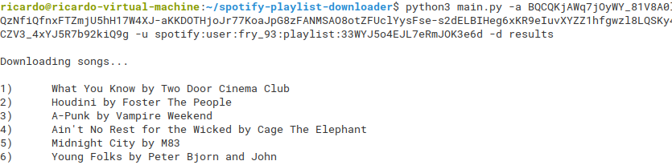
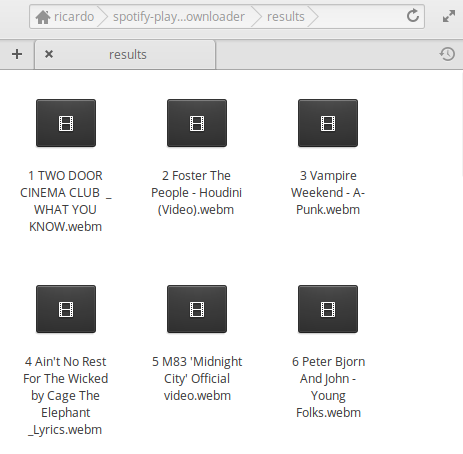
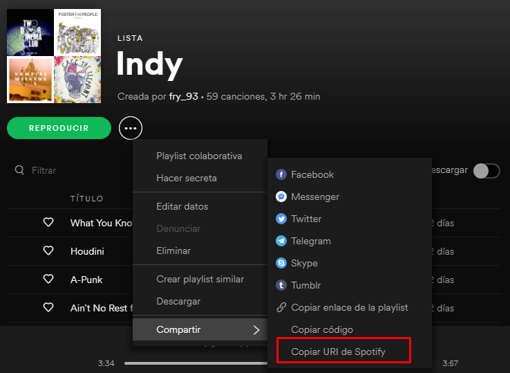

# spotify-playlist-downloader
Downloading Spotify Playlist

```
python main.py -a ACCESS_TOKEN -u PLAYLIST_SPOTIFY_URI -d DIRECTORY
```

--------------------------------------------------


## Example





Result:




--------------------------------------------------

## Steps / Requirements

#### 1) Get your own access token 

You can visit the official page (https://developer.spotify.com/documentation/general/guides/authorization-guide/) or follow these instructions:

- Visit and log into: https://developer.spotify.com/dashboard/applications

- Create a "test" application

- Click "Edit settings" and add "https://example.com/callback/" as "Redirect URIs". Save changes

- Copy your "Client ID" value

- Replace "CLIENT_ID" with your own value and visit 
```
https://accounts.spotify.com/authorize?client_id=**CLIENT_ID**&redirect_uri=http:%2F%2Fexample.com%2Fcallback/&scope=user-read-private%20user-read-email&response_type=token&state=123
```

- Click "Accept" and extract your access token from the url:
```
http://example.com/callback/#access_token=**ACCESS_TOKEN**&token_type=Bearer&expires_in=3600&state=123
```


#### 2) Get the Playlist URI




#### 3) Install dependencies


Python 2.x:

```
sudo apt-get install ffmpeg libavcodec-*
pip install instantmusic
```

Python 3.x:

```
sudo apt-get install ffmpeg libavcodec-*
pip3 install instantmusic
```

## Note

Tested both in Python2.x (2.7.15rc1) and Python 3.x (3.6.7)
